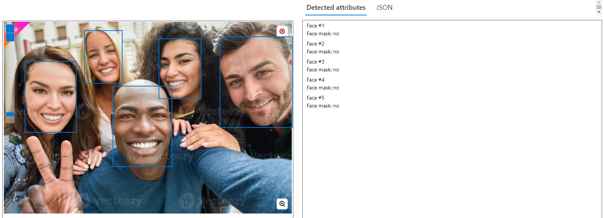
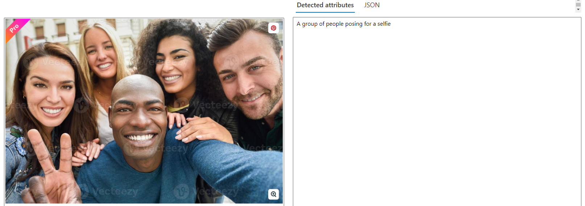

# lab-azure-ai-vision-service
Laboratorio do Azure A.I. Vision Service

Criado workspace no ml.azure.com
Aberto https://portal.azure.com/?azure-portal=true
Clicado no menu a esquerda em "IA + Azure Learning"
Clicado na opção "Serviços Cognitivos" e em criar.
Criado serviço cognitivo informando:
    Detalhes do projeto
        Assinatura: Azure subscription 1
            Grupo de recursos: LAB-01 (grupo criado no ml.azure.com)

    Detalhes da instância:
        Região: East-US
        Nome: lab-azure-ai.vision

    Tipo de preço: Standard S0
    Clicado em "examinar + criar"

Acessado https://portal.vision.cognitive.azure.com/?azure-portal=true

Analise de imagem (Face):
    Clicar na opção FACE da lista de opções;
    Clique na opção Detect faces in an image;
    Na opção "Please select a resource.", informe a assinatura e workspace criados anteriormente;
    Marque a opção "Try it out";
    Upload da IMAGE001.
    

Análise da imagem (Descrevendo cenario):
    Na tela principal do Vision Studio, selecione "Add captions to images";
    Faça upload da IMAGE001.
    

Exemplos de usabilidade levando em considerações outras modalidades não usadas neste exemplo:
    Detectar face para identificar se tem pessoas na foto.
    Traduzir anotações ou documentos antigos para formato texto facilitando importação em sistemas;
    Detectar se há pessoas em um local, quantas são ou distanciamento entre elas.
